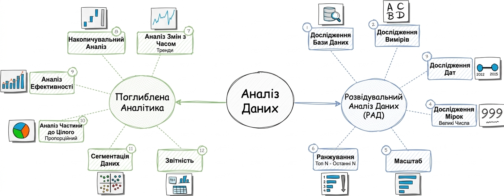

# SQL Exploratory Data Analysis Project
This repository showcases a variety of SQL-based analytical methods, covering time-series trends, cumulative metrics, performance evaluation, data segmentation, and part-to-whole analysis.


## Project Overview
The **sql-exploratory-data-analysis-project** focuses on advanced data analytics using SQL. It is designed to answer real business questions by transforming raw data into actionable insights through structured querying and analytical techniques.

#### Objective
The main objective of this project is to perform advanced exploratory data analysis (EDA) using SQL and simulate real-world business scenarios. The project aims to uncover trends, evaluate performance, and support decision-making through data-driven insights.

### Analytical Framework

This project follows a structured approach to data analysis, as visualized below:


#### Specifications

**Core SQL Techniques**
- Writing complex SQL queries for analytical problem-solving  
- Using window functions (e.g. ROW_NUMBER, RANK, LAG, LEAD)  
- Implementing Common Table Expressions (CTEs) for modular query design  
- Creating and optimizing subqueries  
- Joining multiple tables for comprehensive analysis  
- Building structured reports directly in SQL  

**Analytical Approaches**
- Change-over-time analysis (trend analysis across periods)  
- Cumulative analysis (running totals, growth tracking)  
- Performance analysis (KPIs, comparisons, rankings)  
- Part-to-whole analysis (percentage contribution, share analysis)  
- Data segmentation (grouping users, products, or behaviors)  
- Reporting and summarizing insights for business use

**Environment & Tools**
- SQL (PostgreSQL)  
- Docker for containerized database setup and reproducible environment  

**Outcome**
- Clear and structured SQL queries that answer business questions  
- Insights that can be used for strategic and operational decisions  
- Reusable query patterns for real-world analytics tasks  


## Getting Started

### Prerequisites
- [Docker Desktop](https://www.docker.com/products/docker-desktop/) installed and running.

### How to Run
1. Clone the repository to your local machine.
2. Navigate to the project folder and run:
   ```bash
   docker-compose up -d
 
  Database Connection Details
  To connect to the database (via VS Code SQLTools, DBeaver, or pgAdmin), use the following credentials from the docker-compose.yml file:

**Host:** localhost; <br>
**Port:** 5432; <br>
**User:** admin; <br>
**Password:** root; <br>
**Database:** EdaAnalysis; <br>

#### Execution Order

Run SQL scripts in the following order:

1. `scripts/00_init.sql` – database setup and data loading  
2. `scripts/01–04_.sql` – data exploration and validation  
3. `scripts/05–13_.sql` – analytical queries and reporting  


  ## License
This project is licensed under the MIT License. You are free to use, modify, and share this project with proper attribution.


## About me 
Hey, my name is Anastasiia, I am a Junior Data Engineer wanting to achieve high results.
<br>
I'm open to feedback and would love to discuss the architectural choices I made in this project! <br>
[](https://www.linkedin.com/in/anastasiia-kukhar-mm7mm1/)